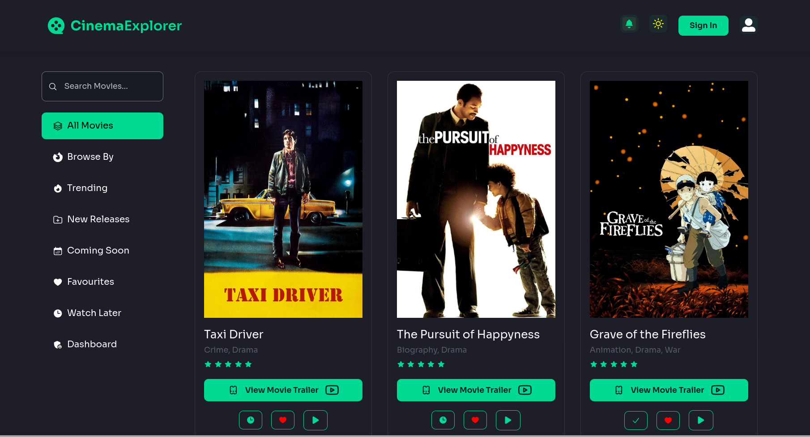
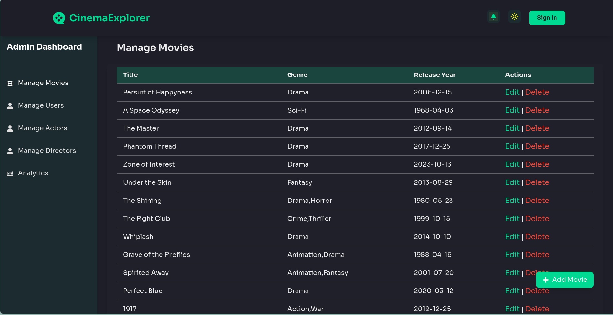

# **Cinema Explorer** 🎬  
Cinema Explorer is a web application for movie enthusiasts to browse, review, and manage their favorite movies. The platform features advanced search, user-specific watchlists, and gamification elements to enhance user engagement.

## **Features**
- **Browse Movies:**
  - Filter movies by genres, ratings, and release years.
  - View movie trailers and detailed information.
- **User Engagement:**
  - Add movies to watchlists and favorites.
  - Write and rate movie reviews.
  - Earn badges through gamification.
- **Admin Dashboard:**
  - Manage movies, actors, directors, and users.
  - Monitor platform analytics.

---

## **Getting Started**

### **1. Clone the Repository**
```bash
git clone https://github.com/refaduL/cinema-explorer.git
cd cinema-explorer
```

### **2. Install Dependencies**
#### Backend:
```bash
cd server
npm install
```
#### Frontend:
```bash
cd client
npm install
```

### **3. Environment Variables**
- Create a `.env` file in both `frontend` and `backend` directories.
- Backend `.env` example:
  ```env
  CLIENT_URL = http://localhost:3000
  PORT=3001
  DB_HOST=localhost
  DB_USER=root
  DB_PASSWORD=password
  DB_NAME=cinemaexplorer
  JWT_SECRET=your_jwt_secret
  SMTP_USERNAME=<your_smtp_username>
  SMTP_PASSWORD=<your_smtp_password>
  ```
- Frontend `.env` example:
  ```env
  REACT_APP_BACKEND_URL=http://localhost:3001
  ```

### **4. Start the Development Servers**
#### Backend:
```bash
cd server
npm start
```
#### Frontend:
```bash
cd client
npm start
```

---

## **Project Structure**

### **Backend**
- **`/src`**
  - **Controllers:** API logic for handling movies, actors, and directors.
  - **Routes:** Endpoints for API calls.
  - **Helpers:** Utility functions for tasks like file uploads.

### **Frontend**
- **`/src`**
  - **Components:** Reusable React components (e.g., MovieCard, AddMovieModal).
  - **Pages:** Key pages such as BrowseBy, AdminDashboard.
  - **Contexts:** State management using React Context API.

---

## **API Endpoints**

### **Movies**
| Method | Endpoint                   | Description               |
|--------|----------------------------|---------------------------|
| GET    | `/api/movies`              | Fetch all movies          |
| POST   | `/api/movies`              | Add a new movie           |
| DELETE | `/api/movies/:movie_id`    | Delete a movie            |
| PUT    | `/api/movies/:movie_id`    | Update movie details      |

### **Actors**
| Method | Endpoint                   | Description               |
|--------|----------------------------|---------------------------|
| GET    | `/api/dashboard/manage-actors`   | Fetch all actors          |
| POST   | `/api/dashboard/manage-actors`   | Add a new actor           |
| PUT    | `/api/dashboard/manage-actors/:actor_id` | Update actor details |
| DELETE | `/api/dashboard/manage-actors/:actor_id` | Delete an actor      |

### **Directors**
| Method | Endpoint                   | Description               |
|--------|----------------------------|---------------------------|
| GET    | `/api/dashboard/manage-directors`   | Fetch all directors       |
| POST   | `/api/dashboard/manage-directors`   | Add a new director        |
| PUT    | `/api/dashboard/manage-directors/:director_id` | Update director details |
| DELETE | `/api/dashboard/manage-directors/:director_id` | Delete a director      |

---

## **Tech Stack**
### **Frontend**
- React (with Context API)
- Tailwind CSS
- React Icons

### **Backend**
- Node.js
- Express.js
- MySQL (with Sequelize ORM)
- Multer (for file uploads)

---

## **Screenshots**
1. **Home Page**  
   

2. **Admin Dashboard**  
   

---

## **Contributing**
Contributions are welcome! To contribute:
1. Fork the repository.
2. Create a new branch:
   ```bash
   git checkout -b feature/your-feature-name
   ```
3. Commit your changes:
   ```bash
   git commit -m "Add some feature"
   ```
4. Push to the branch:
   ```bash
   git push origin feature/your-feature-name
   ```
5. Open a pull request.

---

## **Contact**
If you have any questions or suggestions, feel free to reach out at:  
**Email:** refadul.cse@gmail.com  
**GitHub:** [GitHub Profile](https://github.com/refaduL)
